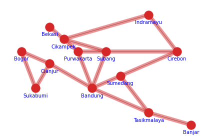
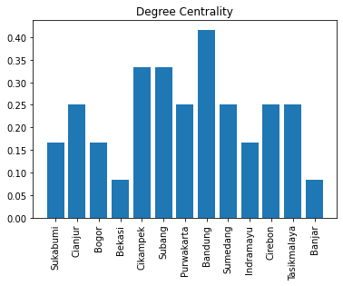
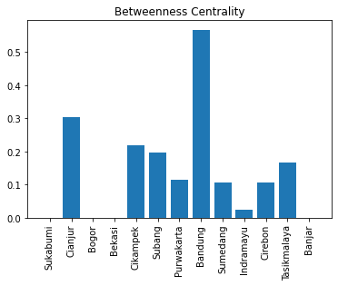

# simple_networkx
 simple network visualization that represent transportation route that connect major cities in West Java. Node position added manually based on approximate position seen on google maps.
 ## Purpose
 Deciding the most importrant city by calculating every city's degree centrality and beetweenness centrality 
 ## Plot
 
 ## Degree Centrality
 
 ## Beetweenness Centrality
 
 ## Conclusion
 So, based on degree centrality and betweeness centrality calculation it can be concluded that **Bandung** is the most important city in West Java
 
